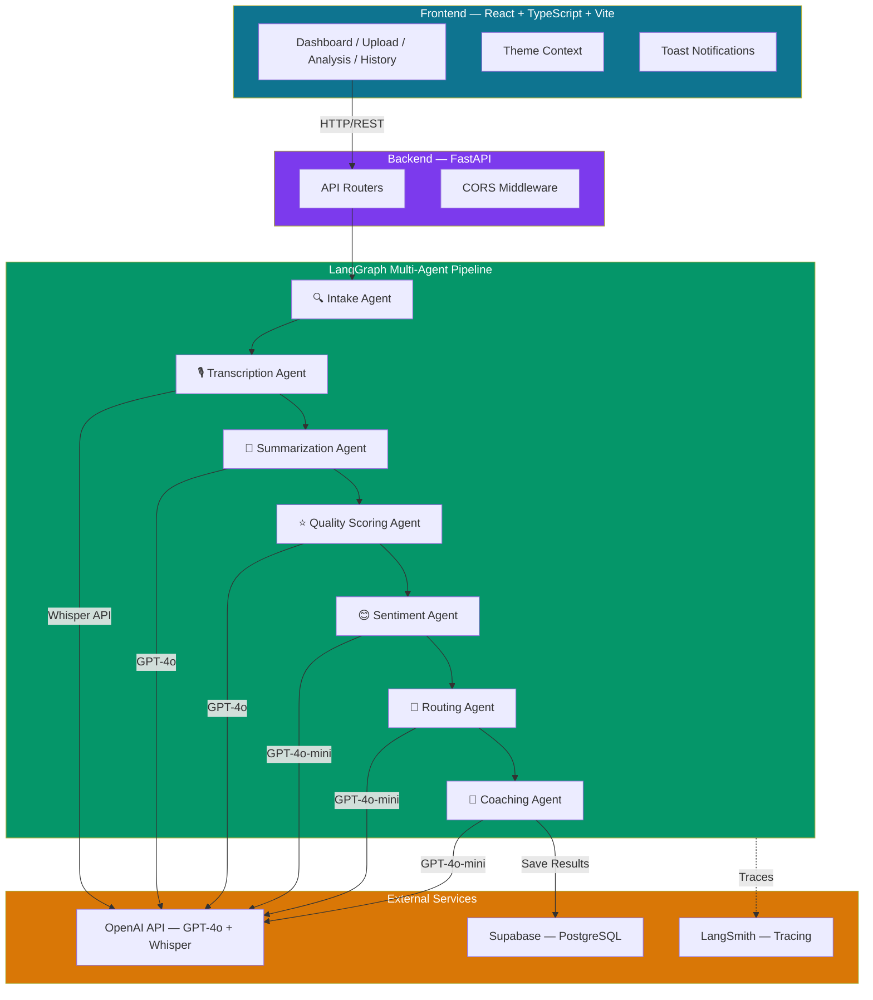
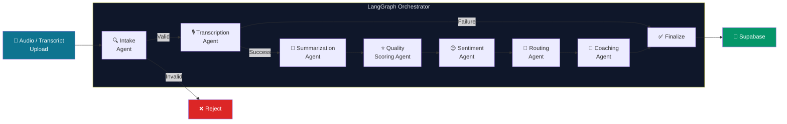
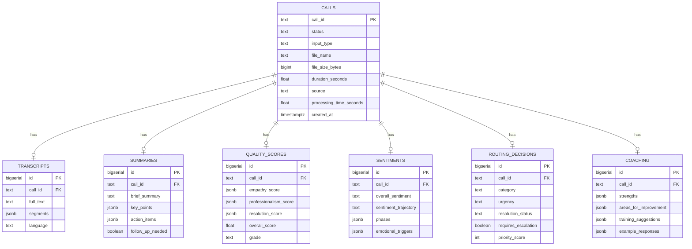
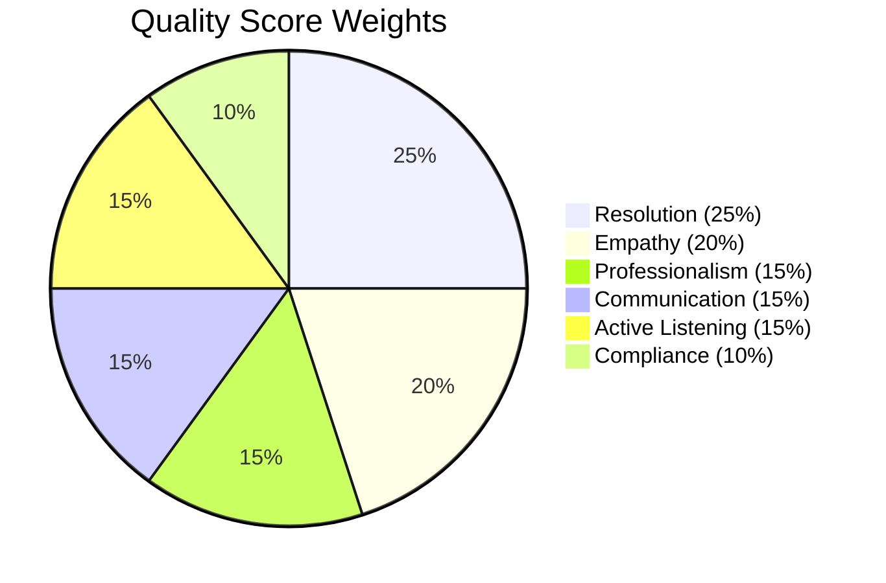

# 🎧 CallSense AI — Intelligent Call Center Analysis Platform

<div align="center">


**An AI-powered multi-agent system that transforms raw call center conversations into structured, actionable intelligence — automated summaries, quality scores, sentiment analysis, routing decisions, and coaching recommendations.**

[Features](#-features) · [Architecture](#-architecture) · [Tech Stack](#-tech-stack) · [Setup](#-getting-started) · [API Docs](#-api-documentation) · [Testing](#-testing) · [Docker](#-docker-deployment)

</div>

---

## 📌 Business Problem

Call centers generate thousands of conversations daily, but extracting meaningful insights from them remains a significant challenge:

- **Manual QA reviews** are slow, inconsistent, and impossible to scale
- **Sentiment and emotional dynamics** are lost in text-only summaries
- **Agent coaching** is reactive rather than data-driven
- **Critical calls** requiring escalation often slip through the cracks
- **Compliance monitoring** relies on random sampling instead of full coverage

**CallSense AI** solves this by deploying a **7-agent AI pipeline** that processes every call through transcription, summarization, quality scoring, sentiment analysis, intelligent routing, and personalized coaching — delivering comprehensive insights in under 60 seconds.

---

## ✨ Features

### Core Analysis Pipeline
- 🎙️ **Audio Transcription** — Whisper API with automatic speaker diarization
- 📝 **Structured Summarization** — Key points, action items, issues, resolution details
- ⭐ **Quality Scoring** — 6-dimension scoring (empathy, professionalism, resolution, communication, compliance, active listening) with weighted overall score and letter grades
- 😊 **Sentiment Analysis** — Phase-by-phase tracking, trajectory detection, emotional triggers
- 🔀 **Intelligent Routing** — Category, urgency, escalation flags, priority scoring, tags
- 🎯 **Coaching Recommendations** — Strengths, improvements, training suggestions, example better responses

### Platform Features
- 📊 **Real-time Analytics Dashboard** — Pie charts, bar charts, stat cards, and trends
- 🌐 **Multi-language Support** — 10 languages (English, Spanish, French, German, Hindi, Japanese, Chinese, Arabic, Portuguese, Korean)
- 📄 **PDF Report Export** — Downloadable professional reports for each analysis
- 🎵 **Audio Playback** — Built-in player to preview recordings before analysis
- 🌓 **Dark/Light Theme** — Toggle with persistence via localStorage
- 📱 **Responsive Design** — Full mobile support with collapsible sidebar
- 🔔 **Toast Notifications** — Real-time success/error/warning/info alerts
- 🔍 **Search & Filters** — Filter call history by status, type, and keywords
- 🐳 **Docker Support** — One-command deployment with docker-compose
- ✅ **36 Unit Tests** — Full test coverage for agents, API, and utilities
- 📈 **LangSmith Tracing** — Optional LLM observability and debugging

---

## 🏗 Architecture

### High-Level System Architecture



### Agent Pipeline Flow



### Database Schema



### Quality Scoring Dimensions



---

## 🛠 Tech Stack

| Layer | Technology | Purpose |
|-------|-----------|---------|
| **Frontend** | React 18 + TypeScript | UI framework |
| **Styling** | Tailwind CSS 3 | Utility-first CSS |
| **Build Tool** | Vite 6 | Fast dev server & bundling |
| **Charts** | Recharts | Dashboard visualizations |
| **Icons** | Lucide React | Consistent icon system |
| **Backend** | Python 3.12 + FastAPI | REST API framework |
| **Agent Orchestration** | LangGraph | Multi-agent pipeline coordination |
| **LLM Framework** | LangChain | Prompt management & structured output |
| **Primary LLM** | GPT-4o | Quality scoring & summarization |
| **Secondary LLM** | GPT-4o-mini | Sentiment, routing, coaching |
| **Speech-to-Text** | OpenAI Whisper | Audio transcription |
| **Database** | Supabase (PostgreSQL) | Data persistence |
| **PDF Generation** | ReportLab | PDF report export |
| **Observability** | LangSmith | LLM tracing & debugging |
| **Containerization** | Docker + docker-compose | Deployment |
| **Testing** | Pytest | Unit & integration tests |

---

## 📁 Project Structure

```
callsense/
├── backend/
│   ├── app/
│   │   ├── agents/                    # 7 AI agents
│   │   │   ├── intake_agent.py        # Input validation
│   │   │   ├── transcription_agent.py # Whisper + diarization
│   │   │   ├── summarization_agent.py # Structured summaries
│   │   │   ├── quality_scoring_agent.py # 6-dimension QA scoring
│   │   │   ├── sentiment_agent.py     # Phase-by-phase sentiment
│   │   │   ├── routing_agent.py       # Category, urgency, escalation
│   │   │   ├── coaching_agent.py      # Training recommendations
│   │   │   └── orchestrator.py        # LangGraph pipeline
│   │   ├── models/
│   │   │   └── schemas.py             # Pydantic data models
│   │   ├── routers/
│   │   │   ├── calls.py               # Call CRUD + analysis endpoints
│   │   │   └── dashboard.py           # Analytics endpoints
│   │   ├── services/
│   │   │   ├── openai_service.py      # GPT + Whisper client
│   │   │   ├── supabase_service.py    # Database operations
│   │   │   ├── audio_service.py       # File handling
│   │   │   └── pdf_service.py         # PDF report generation
│   │   ├── utils/
│   │   │   ├── prompts.py             # LLM prompt templates
│   │   │   └── helpers.py             # Utility functions
│   │   ├── config.py                  # Environment settings
│   │   └── main.py                    # FastAPI entry point
│   ├── tests/
│   │   ├── conftest.py                # Test fixtures & mocks
│   │   ├── test_agents.py             # Agent & utility tests
│   │   └── test_api.py                # API endpoint tests
│   ├── Dockerfile
│   ├── requirements.txt
│   └── .env.example
│
├── frontend/
│   ├── src/
│   │   ├── components/
│   │   │   ├── analysis/              # Analysis view components
│   │   │   │   ├── TranscriptView.tsx # Chat-bubble transcript
│   │   │   │   ├── SummaryView.tsx    # Structured summary cards
│   │   │   │   ├── QualityScoresView.tsx # Score gauges & breakdowns
│   │   │   │   ├── SentimentView.tsx  # Sentiment timeline
│   │   │   │   ├── RoutingView.tsx    # Routing decision display
│   │   │   │   ├── CoachingView.tsx   # Coaching recommendations
│   │   │   │   ├── ProgressTracker.tsx # Real-time pipeline progress
│   │   │   │   └── AudioPlayer.tsx    # Audio playback controls
│   │   │   ├── common/
│   │   │   │   └── index.tsx          # Badge, ScoreCircle, ProgressBar
│   │   │   └── layout/
│   │   │       ├── Sidebar.tsx        # Navigation + theme toggle
│   │   │       └── Layout.tsx         # Responsive layout wrapper
│   │   ├── contexts/
│   │   │   ├── ThemeContext.tsx        # Dark/light mode
│   │   │   └── ToastContext.tsx        # Toast notifications
│   │   ├── pages/
│   │   │   ├── Dashboard.tsx          # Analytics dashboard
│   │   │   ├── Upload.tsx             # Audio upload + transcript input
│   │   │   ├── CallAnalysis.tsx       # Full analysis detail view
│   │   │   └── CallHistory.tsx        # Paginated call list
│   │   ├── services/
│   │   │   └── api.ts                 # Axios API client
│   │   ├── hooks/
│   │   │   └── usePolling.ts          # Status polling hook
│   │   ├── types/
│   │   │   └── index.ts              # TypeScript interfaces
│   │   ├── App.tsx                    # Router + providers
│   │   ├── main.tsx                   # Entry point
│   │   └── index.css                  # Tailwind + theme CSS
│   ├── Dockerfile
│   ├── nginx.conf
│   ├── package.json
│   ├── tailwind.config.js
│   ├── tsconfig.json
│   └── vite.config.ts
│
└── docker-compose.yml
```

---

## 🚀 Getting Started

### Prerequisites

- **Python 3.12+**
- **Node.js 18+**
- **OpenAI API key** ([platform.openai.com](https://platform.openai.com))
- **Supabase project** ([supabase.com](https://supabase.com))

### 1. Clone the Repository

```bash
git clone https://github.com/yourusername/callsense-ai.git
cd callsense-ai
```

### 2. Set Up the Database

Go to your Supabase dashboard → **SQL Editor** → Run:

```sql
-- Creates all 7 tables + indexes
-- Full SQL available in backend/app/services/supabase_service.py (SETUP_SQL)

CREATE TABLE IF NOT EXISTS calls (
    call_id TEXT PRIMARY KEY,
    status TEXT NOT NULL DEFAULT 'pending',
    input_type TEXT NOT NULL DEFAULT 'audio',
    file_name TEXT,
    file_size_bytes BIGINT,
    audio_format TEXT,
    duration_seconds FLOAT,
    source TEXT DEFAULT 'upload',
    caller_name TEXT,
    agent_name TEXT,
    call_date TEXT,
    error TEXT,
    processing_time_seconds FLOAT,
    created_at TIMESTAMPTZ DEFAULT NOW(),
    updated_at TIMESTAMPTZ DEFAULT NOW()
);

-- See supabase_service.py for complete SQL for all 7 tables
```

Then disable Row Level Security:

```sql
ALTER TABLE calls DISABLE ROW LEVEL SECURITY;
ALTER TABLE transcripts DISABLE ROW LEVEL SECURITY;
ALTER TABLE summaries DISABLE ROW LEVEL SECURITY;
ALTER TABLE quality_scores DISABLE ROW LEVEL SECURITY;
ALTER TABLE sentiments DISABLE ROW LEVEL SECURITY;
ALTER TABLE routing_decisions DISABLE ROW LEVEL SECURITY;
ALTER TABLE coaching DISABLE ROW LEVEL SECURITY;
```

### 3. Set Up the Backend

```bash
cd backend

# Create virtual environment
python -m venv venv

# Activate (Windows)
venv\Scripts\activate

# Activate (Mac/Linux)
source venv/bin/activate

# Install dependencies
pip install -r requirements.txt

# Configure environment
cp .env.example .env
# Edit .env with your API keys
```

### 4. Set Up the Frontend

```bash
cd frontend
npm install
```

### 5. Run the Application

**Terminal 1 — Backend:**
```bash
cd backend
venv\Scripts\activate
uvicorn app.main:app --reload
# Running on http://localhost:8000
```

**Terminal 2 — Frontend:**
```bash
cd frontend
npm run dev
# Running on http://localhost:5173
```

Open **http://localhost:5173** in your browser.

---

## 📡 API Documentation

Once the backend is running, visit **http://localhost:8000/docs** for the interactive Swagger UI.

### Key Endpoints

| Method | Endpoint | Description |
|--------|----------|-------------|
| `POST` | `/api/calls/upload-audio` | Upload audio file for analysis |
| `POST` | `/api/calls/analyze-transcript` | Submit transcript for analysis |
| `GET` | `/api/calls/status/{call_id}` | Check analysis progress |
| `GET` | `/api/calls/{call_id}` | Get full analysis results |
| `GET` | `/api/calls/{call_id}/export-pdf` | Download PDF report |
| `GET` | `/api/calls/` | List all calls (paginated) |
| `DELETE` | `/api/calls/{call_id}` | Delete call and all data |
| `GET` | `/api/dashboard/stats` | Get dashboard statistics |
| `GET` | `/health` | Health check |

### Example: Analyze a Transcript

```bash
curl -X POST http://localhost:8000/api/calls/analyze-transcript \
  -H "Content-Type: application/json" \
  -d '{
    "transcript": "Agent: Hello, how can I help? Customer: I have a billing issue...",
    "language": "en"
  }'
```

**Response:**
```json
{
  "call_id": "call_a1b2c3d4e5f6",
  "status": "processing",
  "message": "Transcript received. Analysis started in background.",
  "progress_percent": 10
}
```

---

## ✅ Testing

```bash
cd backend
pytest tests/ -v
```

**36 tests** covering:

| Test Suite | Count | Coverage |
|------------|-------|----------|
| Helper utilities | 13 | JSON parsing, scoring, validation |
| Pydantic schemas | 4 | Enum values, data models |
| Intake Agent | 3 | Valid, too short, too long |
| Summarization Agent | 1 | Mocked LLM response |
| Quality Scoring Agent | 1 | Score calculation + grading |
| Sentiment Agent | 1 | Sentiment enum validation |
| Routing Agent | 1 | Category + urgency mapping |
| Coaching Agent | 1 | Recommendation structure |
| Health endpoints | 2 | Root + health check |
| Call CRUD endpoints | 7 | Create, read, delete, status |
| Dashboard endpoint | 1 | Stats aggregation |
| **Total** | **36** | **All passing** |

---

## 🐳 Docker Deployment

### Quick Start

```bash
# Build and run both services
docker-compose up --build

# Frontend: http://localhost:80
# Backend:  http://localhost:8000
```

### Individual Containers

```bash
# Backend only
cd backend
docker build -t callsense-backend .
docker run -p 8000:8000 --env-file .env callsense-backend

# Frontend only
cd frontend
docker build -t callsense-frontend .
docker run -p 80:80 callsense-frontend
```

---

## 📈 LangSmith Tracing (Optional)

To enable LLM observability and debugging:

1. Sign up at [smith.langchain.com](https://smith.langchain.com)
2. Create an API key
3. Update your `.env`:

```env
LANGCHAIN_TRACING_V2=true
LANGCHAIN_API_KEY=your_langsmith_api_key
LANGCHAIN_PROJECT=callsense-ai
```

4. Restart the backend — all LLM calls will now be traced and visible in the LangSmith dashboard.

---

## 🎨 Screenshots

### Dashboard
> Analytics overview with stat cards, sentiment/category pie charts, urgency bar chart, and recent calls.

### Upload Page
> Drag-and-drop audio upload with built-in player, or paste transcript with language selection.

### Analysis — Quality Scores
> Circular score gauge with letter grade, expandable 6-dimension score cards with highlights and improvements.

### Analysis — Sentiment Timeline
> Phase-by-phase sentiment tracking with emoji indicators, trajectory detection, and emotional triggers.

### Analysis — Coaching
> Strengths, improvement areas, training suggestions, and example better responses.

### Light Mode
> Full light theme support with consistent styling across all pages.

---

## 🙏 Acknowledgments

- **Interview Kickstart** — SDE Pathway capstone project framework
- **OpenAI** — GPT-4o and Whisper API
- **LangChain / LangGraph** — Agent orchestration framework
- **Supabase** — Database and backend services

---

<div align="center">

**Built with ❤️ by Abinesh**

*CallSense AI — Capstone Project, Interview Kickstart SDE Pathway*

</div>
